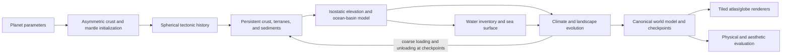

# Comprehensive World Simulator Plan

Status: active implementation roadmap. This document does not authorize deployment and does not preserve the current continent generator as a constraint.

## Implementation status

The first deterministic whole-world slice is now implemented independently of the current generator:

- `lib/tectonics/` contains the closed icosphere, Euler kinematics, geodesic boundary frames, persistent boundary hysteresis, conservative oceanic conveyor fixtures, and a deterministic whole-world simulator.
- `lib/tectonics/parcelTransport.ts` adds persistent parcel IDs and material, exact rigid Euler advection, and deterministic conservative remapping onto the geodesic control faces. It reports raw landing gaps/overlaps, resolved coverage, per-parcel and per-face closure, provenance closure, crust-area closure, thickness-volume closure, and mean/maximum remap distance.
- The whole-world simulator evolves fixed geodesic control volumes with persistent crust type, age, thickness, density, provenance, rift exposure, compressional uplift, arc accretion, isostatic elevation, age-dependent bathymetry, and one canonical area-weighted sea level.
- Continental material is initialized as several widely separated plate-aware crustal communities, each assembled by unequal competing terrane lobes. Private lobe budgets include bounded overlap reserve so the global inventory can close without a smooth union-front fallback dominating the silhouette. The number of emerged landmasses still results from crust history and flooding rather than a final continent-count control.
- `lib/spherical/` and `lib/evaluation/` contain exact spherical raster areas, canonical-mask comparison, and multiscale ribbon, neck, gulf, lake, elongation, solidity, perimeter-retention, peninsula/bay, and coastline-richness metrics.
- `npm run evaluate:tectonics` performs deterministic multi-seed hard-gate evaluation and ranks accepted candidates only.
- `npm run render:tectonic-atlas` and `npm run render:tectonic-candidates` render exact scientific or presentation-smoothed atlases without running or deploying the web app.
- `lib/tectonics/surfaceProcess.ts` promotes a tectonic snapshot to a nested spherical surface mesh with geology-conditioned relief, same-medium distance-to-coast, continentality and seasonal-temperature range, spherical annual moisture circulation, orographic precipitation, PET-relative aridity, conservative runoff, Priority-Flood drainage, deep-basin lake cover, resolved river paths and mouths, biome classification, lithology-aware incision, and conservative sediment transfer.
- The resolution-independent surface sampler exposes one canonical world through synchronized natural, heightmap, climate, biomes, precipitation, aridity, temperature, continentality, drainage, depression, geomorphology, coasts, wind, lithology, and orogeny modes. Presentation resolution and style do not reclassify canonical topology anchors.
- The external capability references supplied on 2026-08-24 are catalogued in `docs/references/reddit-world-simulator/README.md`. They are design targets, not generated fixtures and not licensed product assets.

This slice now generates complete flooded planets and is suitable for testing macro organization, causal geology, first-order surface processes, annual climate, and reduced monthly lake storage. `fixed-geodesic-control-volume-v1` remains the reference history and `lagrangian-parcel-snapshot-v1` remains the exact remap conformance path. `coupled-conservative-cell-history-v1` performs explicit adjacent-edge finite-volume transport every timestep, carries fractional continental and plate mixtures plus deformation memory, and lets moved state change later boundary forcing. Ridge underfill and convergent overfill are explicit paired creation/subduction budgets; continental material is shortened rather than preferentially subducted. Area-preserving VOF compression limits first-order interface diffusion. Current coupled runs are evaluated at both their simulation subdivision and target raster tier because coarse winners are not assumed to remain valid at high detail. Placement gates cover effective continent count, dominant land share, polar land share, zonal/circumpolar occupancy, elongation, necks, gulfs, and scale-space coastline richness. A shared physical-distance present-day margin classifier now drives coast character and a first topology-preserving coastal-plain pass. This remains a reduced prototype rather than a final mantle/lithosphere or climate solver: persistent parcel identities through creation/destruction, overlap-area remapping, plate splits/mergers, persistent passive-margin rift age, seasonal atmospheric circulation, ocean heat transport, lake stratigraphy, and accreting delta bodies remain incomplete.

### Milestone: annual physical atlas

The annual physical-atlas milestone is reached when a single accepted tectonic snapshot deterministically produces all of the following without renderer-specific geography:

- continuous terrain, bathymetry, geology, coast distance, temperature, precipitation, aridity, drainage area, and discharge;
- derived deep-basin lake cover and sixteen marine/terrestrial biome classes with exact spherical area closure;
- conservative runoff and sediment budgets, canonical coast anchors, and deterministic surface sampling;
- adaptive coast antialiasing and smoothed hierarchical river presentation at raster time;
- synchronized natural and scientific atlas modes suitable for fixed-seed visual comparison.

This milestone does not claim seasonal general circulation, explicit lake time evolution, ocean-current heat transport, ecological succession, or settlement simulation. Those remain downstream of annual-field calibration.

## Decision

Replace the current hand-shaped continent grammar with an evolving spherical crust and plate-history simulator.

The product-default model should be a **hybrid kinematic tectonic simulator**:

- exact rigid plate motion on a sphere using Euler rotations;
- approximate force/torque feedback so motion responds to slabs, ridges, collisions, and mantle-scale flow;
- continental and oceanic crust represented as persistent material carried by plates, not as plate polygons;
- explicit spreading, rifting, subduction, terrane accretion, suturing, volcanism, isostasy, erosion, sedimentation, climate, and hydrology;
- a separate high-resolution geomorphic and rendering layer;
- physical plausibility gates followed by aesthetic selection, rather than a single score that lets attractive detail hide a malformed continent.

This is deliberately not a full mantle-convection solver in the browser. Research systems such as [ASPECT](https://aspect.geodynamics.org/) and [Underworld](https://www.underworldcode.org/) solve much more complete continuum mechanics, but they are HPC-oriented and highly sensitive to uncertain rheology. Even valid simulations can yield stagnant lids, two hemispheric plates, or other outcomes that are scientifically interesting and aesthetically useless. They should be used offline to calibrate and challenge the reduced model.

The closest product-fit precedent is Cortial et al.'s [Procedural Tectonic Planets](https://perso.liris.cnrs.fr/eric.galin/Articles/2019-planets.pdf): it evolves spherical plates and crust through spreading, subduction, collision, and rifting at roughly 2 Myr timesteps. We should adopt its central insight—persistent evolving crust—while replacing its heuristic initialization, simple erosion, and coarse final-surface treatment.

## What plate tectonics will and will not fix

Plate tectonics should fix the missing causal structure:

- old compact cratons;
- passive margins inherited from successful rifts;
- failed rifts and continental basins;
- sutures and broad collision belts;
- ocean ridges and age-ordered seafloor;
- trenches, continental arcs, island arcs, and accreted terranes;
- hotspot chains that record plate motion;
- mountain belts that follow actual geologic history.

It will not automatically make coastlines beautiful. A coastline is the intersection of an evolved elevation field and sea level. Its character depends on crustal shape and thickness, rift history, erosion, sediment, glaciation, water inventory, and the scale of the final surface model. More physics can still generate a smooth coast or a stringy continent.

The structural rule is therefore:

> Plate boundaries are not coastlines. Continental crust is persistent buoyant material that may be emerged or submerged; a landmass is a connected region of the final flooded surface and may include continental, arc, or volcanic crust.

That distinction is the main departure from both the current Atlas Forge generator and the older `worldgen/` plan.

## Accuracy contract

“As accurate as possible” needs three explicit levels so the app does not imply certainty that planetary science does not have.

### Product mode: evolving reduced physics

This is the interactive generator and the main implementation target. It conserves topology and material, uses correct spherical kinematics, models the important causal processes, and is calibrated against Earth data and controlled numerical experiments.

It should be physically interpretable, deterministic, inspectable, and fast enough to iterate in a browser.

### Calibration mode: offline research experiments

Use ASPECT, Underworld, or similar native solvers for representative boundary cases:

- continental extension and breakup;
- ocean-continent and ocean-ocean subduction;
- continent-continent collision;
- ridge-transform systems;
- slab rollback and arc curvature;
- parameterized mantle-flow spectra.

These runs bracket plausible widths, rates, lags, and uplift responses and can falsify reduced-model behavior. Because results depend on rheology and setup, they do not provide universal transfer functions for product mode. They do not directly generate every user world.

### Experimental geodynamics mode: possible future feature

A future native or cloud batch mode could run a much fuller mantle model. It should be labeled experimental because self-generated plates, continental-crust evolution, billion-year history, high-resolution geomorphology, aesthetic control, and interactive performance are not simultaneously solved problems.

The first supported planetary regime should be an Earth-like mobile lid. Planet mass, heat, water, and lithosphere parameters can broaden later. Earth is currently the only observed active plate-tectonic planet, and research shows tectonic regime is sensitive to lithosphere strength, convective stress, and initial conditions.

## Core architecture

The simulation and renderer should be independent products joined by a versioned world model.

### Coupled representations

Use three representations, each for the job it handles well.

1. **Quasi-uniform spherical topology.** Use a hierarchical icosahedral triangular mesh or comparable geodesic mesh for plate membership, boundaries, global adjacency, conservative areas, and drainage topology. Every cell stores a unit-vector position and solid-angle area. No stage may infer physical distance from equirectangular pixels.

2. **Lagrangian crust material.** Persistent parcels or plate-local triangles carry crustal history as plates rotate, split, collide, and accrete. This is what gives a suture, passive margin, or old arc a history rather than a fresh noise value every generation.

3. **Hierarchical cubed-sphere raster tiles.** Use six low-distortion faces for climate fields, local surface processes, WebGPU compute, mipmaps, and high-resolution rendering. Cubed-sphere grids avoid a polar singularity and map efficiently to rectangular GPU textures; [MITgcm](https://mitgcm.org/public/r2_manual/latest/online_documents/node282.html) and NOAA's [FV3](https://www.gfdl.noaa.gov/fv3/) are established global precedents.

4. **Finite-width deforming networks.** Plate interiors remain approximately rigid, but rifts, collisions, diffuse plate-boundary zones, and young orogens occupy finite-width networks. These carry strain, damage, and interpolated velocity independently of rigid interiors and may nucleate microplates or new boundaries. Without this layer, collision mountains become linear sheets and rifts become line cuts even when the Euler kinematics are correct.

### Coupling and authority contract

The three discretizations must not independently evolve equivalent state.

- Crust parcels are authoritative for material, age, thickness, and provenance.
- The geodesic mesh is authoritative for plate adjacency, boundary topology, and conservative global accounting.
- Cubed-sphere fields are derived process grids for climate, surface evolution, and rendering.
- Land/sea classification is computed once from canonical elevation and water level, then sampled by every projection and style.

Every transfer records source and destination areas and conserves crust volume, water, sediment, and area within declared tolerances. Parcel-to-grid coverage, grid-to-parcel feedback, remap frequency, coarsening, and provenance transfer must be explicit algorithms. Round-trip fixtures must bound numerical diffusion, coastline displacement, and provenance loss.

The geologic model must remain stable when a user changes projection, style, or output resolution. An 8K or 10K render is a tiled observation of the same model, not a new simulation.

### Suggested implementation stack

- Rust numerical core compiled to WASM.
- Structure-of-arrays typed storage with stable IDs and explicit units.
- Web Workers for simulation, tile production, cancellation, and progress.
- A deterministic single-thread CPU/WASM authority path.
- Optional WASM threads for parallel field updates.
- WebGPU only for field-parallel work such as diffusion, local erosion stencils, rasterization, shading, and mip generation.
- React/TypeScript for controls, inspectors, timelines, and debug overlays.
- OffscreenCanvas or worker-owned tile buffers so high-resolution work never blocks the UI.

Graph mutation and canonical topology should remain in CPU/WASM initially. GPU floating-point results can vary by device, so GPU output should be tolerance-tested rather than used as a golden deterministic oracle.

Maintain two execution contracts. **Reference mode** is single-threaded CPU/WASM with fixed traversal and reduction order and bit-stable canonical integer, topology, ID, and quantized checkpoint fields. **Fast mode** may use threads and WebGPU but must preserve topology and classification while meeting numerical tolerances and distributional equivalence. Cross-language conformance vectors must specify PRNG version, Float32/Float64 rounding, reduction order, SIMD/thread authority, and endianness. A Rust migration creates a new simulation version unless it intentionally reproduces the existing JavaScript seed stream.

Separate configuration into versioned `SimulationRecipe`, `SurfaceRecipe`, and `RenderRecipe` schemas. A style or projection change may invalidate render tiles, but cannot alter geology or the canonical coast.

## Planet and initial-condition model

### Planet parameters

The canonical configuration should include physical values rather than hidden pixel-scale constants:

- radius, mass, surface gravity, circumference;
- rotation period, obliquity, eccentricity, and stellar flux;
- surface water inventory;
- atmosphere mass and composition at the fidelity climate requires;
- mantle heat or secular cooling proxy, mantle thickness, and core radius;
- lithosphere strength/yield proxy;
- tectonic regime preset and simulated geologic duration;
- simulation resolution and surface/render resolution as separate values.

Planet size must affect the system physically. Feature wavelengths, minimum craton scale, plate-size distributions, deformation widths, drainage thresholds, and erosion rates should be expressed in kilometers or nondimensional physical ratios. Increasing circumference does not by itself imply more plates or continents. Characteristic tectonic scale depends on relationships among radius, mantle thickness, a convective-wavelength or Rayleigh proxy, lithosphere strength, heat loss, and forcing spectrum. Size changes the number of independently resolvable systems only through those relationships.

### Initial continental material

Do not ask for a final continent count.

Initialize an asymmetric population of cratonic nuclei and older mobile belts, preferably from a supercontinent-cycle state rather than evenly distributed final blobs. Sample scale and composition from broad distributions conditioned on surface area and tectonic regime. Allow a few aggregates to dominate while smaller terranes remain scattered.

This still requires initial-condition parameters; full emergence from mantle convection is outside product mode. The honest distinction is that we seed **crustal material and plate scale**, not “six continents.” The eventual number, size, and spacing of landmasses emerge from rifting, spreading, subduction, collision, erosion, and water level.

Avoid uniform Poisson placement. Use clustered, hierarchical, and anisotropic priors with a random global rotation. Low-degree spherical fields can create broad mantle provinces and weak zones without creating latitude bands. Every reference metric must be rotationally invariant so the generator does not learn “north/south symmetry” or equally spaced longitude sectors.

### Initial plates

Plate regions may begin from a spherical tessellation, but their size distribution should be deliberately unequal and should not determine continental borders. Sample a characteristic plate scale from the planet configuration, then permit splits, boundary migration, subduction, and suturing during the history.

A sampled initial plate count is acceptable internally; it is not a final continent count. A more dynamic reduced model can later derive plate birth and death from accumulated rift damage, subduction, and torque changes.

## Persistent state

Each crust parcel should carry at least:

- plate ID and terrane/provenance ID;
- continental, transitional, oceanic, arc, or volcanic crust class;
- crust and lithosphere thickness;
- density/buoyancy and a simplified composition class;
- thermal age, including ocean-floor age;
- sediment thickness and erosion/deposition budget;
- strain, damage, and extension history;
- orogeny type, age, intensity, and fold direction;
- ridge direction for young oceanic crust;
- volcanic source and age;
- current elevation and confidence/debug flags.

Track continental-crust volume separately from emerged area. Arc magmatism and terrane accretion may add differentiated crust; extension thins it; erosion redistributes it as sediment; explicit subduction erosion, delamination, or recycling may remove it. The first implementation may hold total continental volume approximately fixed, but that must be declared as a product-mode approximation.

Each plate should carry:

- Euler pole and angular velocity;
- dynamic boundary graph and neighbors;
- area, oceanic age inventory, and continental buoyancy;
- approximate driving and resisting torques;
- slab inventory, collision history, and rift state;
- stable lineage through splits and mergers.

Checkpoints should store sparse state and event logs rather than every full field at every timestep.

Material storage needs an explicit complexity bound. Spreading may refine parcels locally, but refinement and coarsening must keep active elements within a configured multiple of canonical cells while conserving area, age moments, thickness, volume, and provenance. Retired oceanic crust is summarized before deletion. Performance reports must include active parcels, boundary edges, checkpoint bytes, and tile-cache bytes, not only surface-cell count.

## Tectonic timestep

At every timestep the boundary network must remain a complete partition of the sphere. Divergent area creation, convergent destruction, transform motion, deforming zones, and triple-junction migration are solved together. Gaps and overlaps may not be independently painted or clipped: exposed area must equal crust created at spreading boundaries, while overlapping area must be assigned to explicit subduction, collision, or deformation. This global closure problem is the highest-risk core algorithm.

Begin with 1–2 Myr timesteps over roughly 300–800 Myr. The exact duration becomes a user-facing “world age/history” concept only after tests show it behaves coherently.

For a point \(\mathbf p\) on plate \(i\), rigid spherical velocity is:

\[
\mathbf v_i(\mathbf p) = \boldsymbol\Omega_i \times \mathbf p
\]

This is the same finite-rotation foundation used by [GPlates](https://www.gplates.org/docs/user-manual/reconstructions/). At a shared boundary, decompose relative velocity into normal and tangent components to classify convergence, divergence, and transform motion.

Each step should:

1. Update plate Euler vectors.
2. Rotate Lagrangian material exactly on the sphere.
3. Extract boundaries from fixed geodesic adjacency in linear time, updating changed boundary bands after ordinary steps. Reserve local topology mutation for rifts, splits, sutures, and mergers; a full global rebuild is a validation fallback.
4. Classify each boundary segment and choose polarity where required.
5. Apply boundary-specific crust processes.
6. Update thickness, age, thermal state, density, sediment, and coarse elevation.
7. At selected tectonic intervals, update reduced climate/runoff and run coarse erosion, sediment transfer, basin fill, and isostatic response.
8. Trigger rifts, plate splits, sutures, or mergers when accumulated state crosses thresholds.
9. Enforce material, area, topology, and age invariants.
10. Store an event/checkpoint when topology or output-relevant history changes.

### Approximate torque feedback

Assigned independent random plate velocities would reproduce a major weakness of the current system. Early fixtures should use temporally correlated prescribed Euler vectors or a coarse mantle-traction field. After subduction, slab, rift, and collision state is stable, solve a damped reduced torque balance for each plate:

\[
\boldsymbol\tau_{slab} + \boldsymbol\tau_{ridge} +
\boldsymbol\tau_{suction} + \boldsymbol\tau_{collision} +
\boldsymbol\tau_{mantle} - \mathbf C_i\boldsymbol\Omega_i = 0
\]

Terms can include slab pull from old subducting lithosphere, ridge push from bathymetric potential, collision resistance, transform resistance, and a slowly evolving low-degree mantle-traction field. This is phenomenological, but it lets motion respond to history. Plate-driving studies commonly frame the problem as a balance of driving and resisting torques; the exact force magnitudes remain scientifically debated.

### Boundary processes

Boundary type and polarity are persistent segment state, not a fresh pointwise classification each frame. Relative velocity proposes transitions, but inherited weak zones, neighboring segments, triple-junction compatibility, buoyancy, slab continuity, and temporal hysteresis determine whether a segment remains a ridge, transform, trench, collision zone, or failed rift. This prevents small velocity changes from producing alternating or flickering boundary types.

**Ocean-ocean divergence** creates age-zero oceanic crust, ridge topography, and a spreading direction. New crust must be inserted conservatively rather than painted into a gap.

**Continental divergence** first stretches and thins crust. It creates fault-bounded basins and may fail. Only sustained extension crossing breakup thresholds should create a narrow sea and eventually a passive margin. This is essential to prevent every rift from becoming a snake-like ocean.

**Ocean-continent convergence** subducts oceanic crust, creates a trench and accretionary wedge, thickens/uplifts the margin, and places a volcanic arc landward with an age and distance tied to slab geometry.

**Ocean-ocean convergence** uses age and buoyancy as polarity inputs, but inherited weak zones, existing slab continuity, trench history, relative motion, and neighboring-segment compatibility take precedence. Store slab age, length/depth proxy, dip, rollback rate, and polarity so trenches and curved island arcs migrate coherently. Arc islands share boundary history; they are not independent noise specks.

**Continent-continent convergence** resists subduction, sutures terranes, thickens crust, broadens deformation, and creates a long-lived orogen and foreland basin.

**Transform motion** accumulates shear and damage without creating or destroying crustal area.

**Hotspots** remain approximately fixed or slowly moving in a mantle frame. Plate advection over them creates age-progressive volcanic chains, consistent with the basic [USGS hotspot model](https://www.usgs.gov/faqs/what-a-hotspot-and-how-do-you-know-its-there).

## Elevation, sea level, and surface evolution

### First-order elevation

Continental elevation should derive from crust thickness and buoyancy through an Airy-like isostatic approximation, modified by:

- collision and subduction-zone thickening;
- extension and rift thinning;
- volcanic construction;
- sediment and water loading;
- flexural or broad dynamic-topography terms;
- erosion and unloading.

Ocean bathymetry should depend strongly on seafloor age. Young seafloor deepens approximately with the square root of age before tending toward an older-plate asymptote, following the classic [Parsons–Sclater relationship](https://doi.org/10.1029/JB082i005p00803). This naturally creates coherent ridges, abyssal plains, and basin depth rather than generic blue noise.

### Sea level and water coverage

Store a physical water inventory and solve a global sea datum from basin hypsometry. This is a uniform-geopotential proxy; a true equipotential surface would require rotation, gravity anomalies, a geoid, and dynamic-topography coupling that product mode does not initially solve. Water volume and area accounting must still be preserved.

An “ocean percentage” control and a sea-level quantile are functionally equivalent for a fixed heightfield. Renaming the control does not create better ocean spacing. Ocean percentage can be offered as an inverse-calibration convenience that chooses the water inventory needed to hit a target, while water inventory remains the model input.

Continents should be identified only after flooding the evolved topography. Do not keep continent IDs from the initial crust seeds.

### Landscape evolution

Use a staged surface model:

1. Priority-Flood or equivalent depression handling on the canonical drainage topology.
2. Climate-conditioned runoff and discharge accumulation.
3. Implicit stream-power incision and hillslope diffusion, following the linear-complexity approach used by [FastScape](https://fastscape.org/).
4. Sediment entrainment, transport, deposition, basin fill, and deltas.
5. Coastal erosion and shelf construction.
6. Glacial incision and deposition in a later milestone.

The high-resolution surface layer should amplify terrain from the coarse physical control maps while preserving drainage. Multi-scale erosion and planet-scale hyper-amplification research shows that this can add valleys, cliffs, ridges, and fine coast detail without running tectonics at every output pixel.

This is where 8K–10K output becomes useful. Resolution alone does not add geographic complexity; it only reveals complexity whose wavelengths and process counts already exist in the model.

## Preventing stringy, evenly spaced, or looped worlds

The model should prevent known pathologies causally where possible:

- give cratonic interiors persistent thickness and buoyancy;
- require cumulative strain before breakup;
- permit failed rifts;
- accrete buoyant terranes rather than subducting them;
- allow suturing to close narrow seas;
- use unequal plate/craton scale distributions;
- use asymmetric low-degree mantle forcing instead of latitude bands;
- distinguish enclosed lakes from deep, narrow-mouth gulfs;
- continue simulating or reject snapshots trapped in pathological two-plate/great-circle regimes.

It should also measure failures directly. A world does not pass because an area-weighted average is good while one continent is a ribbon.

## Evaluation architecture

Replace the single quality score with three gates.

### Gate 1: physical invariants

Failures are rejected, not traded against other metrics:

- spherical cell areas sum to the sphere area;
- every rigid plate consists of explicitly enumerated valid connected components with closed, non-overlapping boundaries whose union covers the sphere;
- terrane and provenance IDs may be disconnected, but lineage, material totals, and component identities remain valid;
- crust creation, destruction, and transfer balance within tolerance;
- oceanic age is zero at ridges and normally increases away from them;
- subduction does not consume continental material without an explicit exceptional process;
- collision thickens or deforms crust;
- transforms do not create or destroy area;
- water and sediment budgets close;
- hydrology has no unintended cycles and reaches a declared outlet or sink;
- lake levels and spillways are consistent.

### Gate 2: empirical plausibility

Use calibrated distributions, not one target value:

- plate and terrane size distributions;
- ocean-age/bathymetry relationship;
- global land/ocean hypsometry and shelf widths;
- mountain width, length, continuity, orientation, and relationship to recent or fossil tectonics;
- drainage density, basin size, river length/discharge hierarchy, Hack and Horton–Strahler distributions;
- island number–area distribution and coherent arc geometry;
- climate-conditioned erosion and discharge.

[NOAA ETOPO 2022](https://www.ncei.noaa.gov/products/etopo-global-relief-model) can anchor global relief and hypsometry. HydroSHEDS or MERIT Hydro can anchor drainage distributions. Several reconstructed Earth epochs should be included so modern Earth is not mistaken for the only plausible arrangement.

### Gate 3: aesthetic composition

Apply non-compensatory per-component pathology limits first: minimum core width, persistent neck splits, deep narrow-mouth gulfs, maximum substantial-component elongation, and unresolved island salt. No planet-wide average may hide a failing major landmass. Rank only physically plausible survivors that pass these caps, preserving a Pareto front rather than reducing all metrics to one scalar.

Every metric declares its minimum supported physical scale from local cell size and sampling density. Structures below roughly three to four samples are unresolved, not absent or passing. The 25–800 km morphology spectrum is evaluated only on an adequately refined surface grid; a 25k-cell Earth-size tectonic preview is restricted to macro metrics. References and generated worlds must share the same admissible scale window.

Measure each major landmass and the full planet on the sphere:

- area-share vector, top-three share, Gini coefficient, and effective component count;
- geodesic diameter versus equal-area radius;
- 3D area-weighted covariance and per-component q90/q95/max elongation;
- largest empty ocean cap, ocean distance-to-land distribution, and ocean-corridor widths;
- rotationally invariant low-order spherical-harmonic power to catch even spacing and latitude bands;
- medial-axis length, local half-width distribution, long thin branch length, and width persistence after erosion at 25–800 km scales;
- split persistence as isthmuses are progressively eroded;
- open-gulf cavity area, mouth width, inland depth, and depth-to-mouth ratio;
- shoreline length, curvature, cape/bay prominence, and lacunarity across physical scales;
- island-size hierarchy, nearest-neighbor structure, archipelago curvature, and arc/boundary offsets.

The current metrics miss several of these exact failures: projected-pixel elongation is latitude-distorted; one erosion radius misses many necks; enclosed-water tests miss C-shaped inland seas; longitude-only centroid gaps miss real spherical spacing; and one scalar allows defects to compensate for strengths.

Use Earth time slices and privately traced silhouettes from the user's reference maps as different reference classes. The Malazan reference is an aesthetic target, not a physical ground truth and should not be redistributed. Analyze every reference at identical physical scales so higher source resolution does not masquerade as better geography.

### Human evaluation

Maintain fixed, blinded contact sheets across seeds and epochs. Ask separate questions about:

- whole-world composition;
- continent silhouettes;
- tectonic/topographic coherence;
- islands and rivers.

Fit pairwise preferences and retain held-out seeds. Keep a labeled pathology corpus: stringy, dumbbell, looped, evenly spaced, repeated-latitude, random island salt, giant narrow-mouth gulf, and sheet mountains. Metric changes must agree with human judgments before they are allowed to drive candidate selection.

## Test program

### Exact fixtures

Build tiny deterministic cases for:

- Euler rotation and boundary-relative velocity;
- spreading ridge and age-ordered crust;
- failed and successful continental rifts;
- oceanic subduction with trench/arc offset;
- continental collision and suture;
- transform motion with zero area creation;
- compact continent versus equal-area ribbon;
- dumbbell landmass at known isthmus widths;
- C-shaped narrow-mouth gulf versus enclosed lake;
- smooth island, salt-noise islands, curved volcanic arc, and hotspot chain;
- bowl, spillway, Y drainage, and sediment-filled basin.

Assertions should be monotonic. Narrowing an isthmus must worsen the neck signature; narrowing a gulf mouth must increase gulf severity; adding only pixel-scale noise must change fine-coast metrics but not macro shape.

### Integration and regression suites

- CPU reference arrays for small models.
- Stage-specific golden hashes for canonical CPU/WASM fields, keyed by simulation version.
- Property tests for adjacency, conservation, topology, and drainage termination.
- Public development suite of at least 50 seeds across parameter strata.
- Hidden holdout suite not used for tuning.
- Nightly 500+ seed distribution run.
- Checkpoints at several tectonic ages, not only the final frame.
- p50 and p95 performance baselines.

### Projection, style, and resolution stability

The canonical land/sea classification belongs to the world model:

- hash canonical labels before rendering;
- query the same spherical samples through globe, atlas, satellite, climate, and ink renderers;
- require identical classifications;
- compare 1K, 2K, 4K, 8K, and 10K renders after resampling the signed-distance field to one physical analysis grid;
- test area, Euler characteristic, component correspondence, shoreline Hausdorff error, and river-centerline correspondence;
- explicitly test both poles, the longitude seam, tile boundaries, and projection round trips.

## Browser performance and high-resolution output

Large in-browser views are feasible only with tiling. An 8192×4096 RGBA buffer is 128 MiB; one full-resolution Float32 field is another 128 MiB. A 10000×5000 RGBA surface is about 191 MiB before depth, normals, climate, or temporary arrays.

Recommended architecture:

- simulation detail independent from render detail;
- approximately 25k canonical cells for quick preview and 100k–250k for high-quality geology initially;
- 256×256 or 512×512 render tiles with mip levels;
- worker-owned model and tile cache keyed by model version, projection, style, zoom, and tile coordinate;
- immediate coarse tiles followed by progressive refinement;
- dependency-based invalidation so style/projection changes never rerun geology;
- early rejection and successive halving: many cheap tectonic histories, a few promoted to surface evolution, one fully rendered;
- cancellation at every timestep and tile batch;
- cached checkpoints so changing sea level or style reruns only dependent stages.

Successive halving is enabled only after measuring rank correlation and false-rejection rate between low- and high-fidelity runs on a fixed audit suite. If coarse runs frequently reject eventual high-quality worlds, use them only for hard physical failures. Record promotion rates and wasted compute.

Initial engineering budgets—not promises—should be:

- no main-thread task longer than 50 ms;
- cached pan/zoom near 16 ms per frame;
- benchmark named workloads: preview at 25k cells × 150 steps, standard at 100k × 300, and high at 150k × 400;
- report p50/p95 stage time, peak resident memory, active parcel count, and checkpoint size on a named CPU, GPU, browser, and build;
- target the preview tier under 5 seconds p95 and the high tier under 60 seconds p95 only after profiling shows those budgets are credible;
- treat histories beyond 400 steps as progressive or batch workloads with their own measured budget;
- first visible cached-model style tiles under 250 ms;
- report first visible tile, full visible viewport, complete tile pyramid, and export/encode separately;
- resident memory under 256 MiB preview and 512 MiB high-quality;
- no individual render allocation over 64 MiB;
- use a progressive cold 8K tile pyramid under 20 seconds on the reference desktop as an initial investigation target, not a release claim.

Profile before committing to WebGPU. Move local stencils and raster work first; do not port irregular graph mutation merely because a GPU exists.

## Reuse and replacement

### Reuse from `worldgen/`

- stage-specific deterministic RNG isolation and ordered stage-runner conventions;
- typed fields, units, stable IDs, and serialization concepts;
- deterministic tie-breakers and property-test philosophy;
- the Priority-Flood concept and deterministic hydrology fixtures after spherical generalization—not the object-heavy implementation, cell-count river thresholds, or local-minimum lake model;
- worker-first and simulation/render separation principles.

Replace the old synchronous serial runner with a dependency DAG, dirty-stage invalidation, checkpoints, cooperative cancellation, and versioned recipes.

### Adapt from Atlas Forge

- React application shell and staged controls;
- the basic worker-ownership pattern and transferable-buffer messaging, while adding model versions, checkpoints, cancellation, cooperative yielding, and a tile cache;
- globe camera and atlas interaction UX, while rewriting projection sampling to query canonical spherical/cubed-sphere data instead of a rendered equirectangular bitmap;
- streamed strip transfer and large-output UX, while replacing output-resolution-dependent shoreline classification;
- palette, hillshade, satellite, and climate-style ideas as downstream observations of one immutable coast;
- debug overlays and snapshot inspection.

### Replace

- planar/cylindrical Delaunay topology;
- static one-time plate ownership and arbitrary velocities;
- ellipse, capsule, branch, and noise continent grammar;
- explicit final continent/system count;
- height offsets unrelated to crustal history;
- projected-pixel quality metrics;
- any style renderer that recomputes or thresholds a different land mask.

The older `worldgen/IMPLEMENTATION_PLAN.md` is a good engineering scaffold, but it explicitly describes conceptual rather than full tectonics. Its clipped planar Voronoi mesh, static plate assignment, rotated-ellipse continents, simple elevation offsets, and uniform wind field should not become the new core.

## Delivery phases and gates

### Phase 0: independent evaluation harness

**Status: implemented and active.** The spherical morphology, placement, canonical-mask, refinement, and remap conformance suites are required by `npm test`; human preference calibration still needs a larger blinded dataset.

Implement the pathology fixtures, spherical shape metrics, canonical mask comparison, reference ingestion, and contact-sheet runner before the new simulator.

Collect a blinded pilot of at least 100–200 pairwise judgments across current outputs, synthetic pathologies, Earth epochs, and private fantasy references before metrics drive candidate selection. Metric directions and composite decisions must agree with held-out human labels; repeat this audit whenever a new metric begins influencing selection.

Exit gate: the harness reliably ranks compact versus stringy fixtures, detects narrow-mouth inland seas, catches even global spacing and latitude bias, and remains stable across resolution and projection.

### Phase 1: spherical model and deterministic engine

**Status: TypeScript reference implemented.** Closed geodesic topology, exact rotations, stable deterministic state, debug layers, and atlas/globe agreement tests exist. Rust/WASM remains an optimization decision rather than a prerequisite.

Create the Rust/WASM workspace, geodesic topology, solid-angle areas, stable material IDs, event log, serialization, worker protocol, and reference TypeScript path.

Exit gate: topology and rotation fixtures pass; repeated runs hash identically; atlas/globe/tile queries agree.

### Phase 2: moving plates and oceanic crust

**Status: reduced reference paths implemented; production coupling incomplete.** Fixed history, exact parcel snapshot transport, and local conservative coupled transport exist. Persistent created/destroyed parcel identities and overlap-area remapping remain open.

Implement Euler motion, closed dynamic boundaries, divergence, new crust insertion, transforms, ocean-floor age, thermal subsidence, and temporally correlated mantle-frame motion.

Exit gate: ridges create age-zero crust; ages and depths progress correctly; material budgets close; no projection seam.

### Phase 3: continental cycle

**Status: partial.** Rifting, convergence, arcs, accreted terranes, sutures, and unequal cratonic assemblies exist in reduced form. Divergent components now accumulate boundary persistence and require sufficient opening speed, connected length, and ocean connection (or unusually long inherited damage) before continental material can break up; shorter landlocked extension remains a failed rift. Dynamic plate topology, mature slab feedback, and calibrated split/merge histories remain open.

Implement continental extension, failed rifts, breakup, passive margins, persistent subduction polarity, slabs, arcs, terrane accretion, collision, suturing, plate splits, and mergers. Add reduced coarse erosion/sediment/isostatic feedback at tectonic checkpoints. Only after stable slab, rift, and collision state exists, enable slab pull, ridge push, collision resistance, and coupled torque feedback; retain the prescribed-motion path as a reference.

Exit gate: controlled fixtures behave causally and a multi-epoch suite produces cratons, oceans, arcs, sutures, and failed rifts without a final continent-count parameter.

### Phase 4: physical topography and water

**Status: first-order implementation complete, calibration ongoing.** Crustal elevation, age-dependent bathymetry, one area-weighted sea level, shelves, flooded land authority, geology-conditioned relief, broad continental-interior relief provinces, and finite-width convergent-margin flexure exist. Interior centers are selected from quiet, old, boundary-distant crust and evaluated at fixed physical wavelengths, so increasing planet radius can create more independent divides rather than stretching the same slope field. Active collision and subduction sources now propagate through continental crust by physical geodesic distance: mountains are followed by a bounded subsiding foreland, sedimentary lithology, and a lower outer flexural rise. Canonical land authority is unchanged. Dynamic topography and empirical hypsometry calibration remain open.

Implement crust-thickness isostasy, ocean-age bathymetry, broad flexure/dynamic terms, water inventory, basin flooding, shelves, and hypsometry.

Exit gate: Earth-like presets fall within selected ETOPO-derived distribution bands; sea changes do not mutate geology; land masks remain renderer-independent.

### Phase 5: surface grid and level-of-detail infrastructure

**Status: partial.** A persistent nested geodesic process grid, canonical ancestry, continuous presentation sampler, and 1K–8K resolution-independent rendering exist. Cubed-sphere tiles, mipmapped browser caches, progressive cancellation, and production 10K rendering remain open.

Implement the cubed-sphere process grid, conservative parcel/geodesic/raster remapping, signed-distance coast, tile boundaries, mipmaps, and level-of-detail infrastructure before full surface processes depend on them.

Exit gate: round-trip remapping meets conservation and diffusion bounds; tile seams are absent; the canonical coast is identical across grids and supported resolutions.

### Phase 6: climate, hydrology, erosion, and sediment

**Status: annual physical-atlas, hierarchical drainage, continuous hydrography, equilibrium lakes, hybrid depression evolution, and the topology-safe geomorphic presentation layer implemented.** Reduced spherical prevailing winds, physical-distance-scaled moisture advection, orographic loss, land distance-to-ocean, continentality, seasonal-temperature range, PET-relative aridity, runoff closure, hierarchical Priority-Flood routing, river hierarchy, stream-power incision, lithology resistance, biome classification, and closed sediment/area budgets exist. Atmospheric pass count, recharge, precipitation loss, recycling, and uplift response are expressed against physical edge distance instead of process-cell count. A deterministic one-level-coarser process world owns inland basin succession, bounded spillway incision, and annual lake level; fine descendants inherit those decisions while refining presentation and local channels. The selected hybrid pass compares discharge and catchment wetness against spillway length, required cut, lithologic resistance, orogenic support, volcanism, cold-basin support, aridity, and basin-scale hydraulic pressure from repeated overtopping. Accepted spillways mutate elevation, after which Priority-Flood, stream-power erosion, lake equilibrium, and runoff routing are recomputed. A second bounded outlet pass runs on final diffused process elevation so erosion-created or newly connected overflowing basins are not retained merely because lake classification occurred after the only incision pass. Closed lakes expand down their resolved depression contour until open-water evaporation balances routed inflow; overflowing lakes consume their evaporation capacity and preserve residual discharge. Every resolved lake now has a public body record containing its member faces, outlet, closed/overflowing regime, area, volume, maximum depth, routed inflow, actual evaporation, and area-weighted structural support. Total runoff closes against ocean outflow plus actual lake evaporation. A conservative explicit hillslope pass transfers equal terrain volume from high to low land cells using physical edge length, lithologic mobility, slope activation, and orogenic support; it cannot cross canonical coasts and drainage is rerouted afterward. Continuous drainage-conditioned valley relief resolves 6–30 km valley widths for presentation without changing process elevation, basin ownership, lake state, or river topology. River paths now refine every resolved edge in world space: hierarchy increases bounded lowland bends while slope, lithologic resistance, and orogenic support confine mountain channels. Shared tangents carry the dominant downstream direction through junctions, bend phase is coherent within an outlet basin, and an explicit land predicate backs curvature down before it can leave its resolved valley. Terminal paths end at their actual land-water edge. Ocean mouths are classified by actual terminal sediment flux, relief, and coast character as deltas, estuaries, alluvial fans, or simple mouths; lake inflows remain distinct, and sediment-scaled delta/fan dimensions plus distributaries are presentation-only. One canonical kilometer-scaled margin field now lets coastline spectra, terrain, and diagnostics agree on active versus tectonically quiet coasts. Quiet low-orogen coasts can receive a bounded sedimentary coastal plain up to 780 km inland; active margins remain rugged, and the canonical land mask is fixed. A three-seed causal gate requires both regimes, nonzero plains and deltas, unchanged topology anchors, and floating-point runoff/sediment closure. Lake presentation uses a continuous radial-basis reconstruction of each solved Priority-Flood depth contour. Surface relief distinguishes narrow continental-collision cores, landward subduction ranges, oceanic island arcs, inherited sutures, broader foothills, and physically scaled quiet-interior swells that split otherwise planar continental drainage. Seasonal pressure/circulation, mass-conserving delta-body growth, passive-margin rift-age memory, and empirical biome calibration remain open.

The finite-width flexural baseline carries active collision and subduction loading inland by geodesic distance rather than mesh-ring count. A five-seed calibration places strong forelands across 11–24% of land, outer flexural support across 16–30%, and caps realized subsidence at 0.33–0.50 km while runoff and sediment budgets retain floating-point closure. On the coupled review world, enabling flexure slightly reduces adjacent-channel alignment, increases sinuosity, reduces oversized lake area, and keeps inherited drainage-anchor mismatches at zero.

Implement atmospheric circulation at an appropriate reduced fidelity, moisture/orography, runoff, Priority-Flood, rivers, stream-power incision, hillslope diffusion, sediment, lakes, deltas, and high-resolution geomorphic amplification on the established process grid.

Monthly lake hydrology is now implemented as a conservative reduced layer over the annual climate backbone. Twelve deterministic runoff fractions respond to latitude, monsoon/storm-track support, freeze-thaw, and snowmelt; each resolved lake spins up bounded storage, ice, evaporation, and overflow to a periodic year. Annual inflow is exactly partitioned across months, downstream lakes receive upstream monthly overflow, and global lake/runoff residuals remain below `1e-8 km³/year`. Public lake bodies retain rift and convergence exposure, origin, perennial state, seasonal range, and a deliberately conservative long-lived classification. This is not yet a seasonal atmosphere or lake-stratigraphy model.

Exit gate: water and sediment conserve; drainage tests pass; rivers have plausible scale-dependent hierarchy; mountains cease looking like flat height sheets; amplification preserves basin and coastline topology.

### Phase 7: browser renderer and aesthetic calibration

**Status: annual atlas diagnostics and topology-safe geomorphic presentation baseline implemented.** Natural, heightmap, climate, biomes, precipitation, aridity, temperature, continentality, drainage, depression, geomorphology, coasts, wind, lithology, and orogeny modes share one canonical world in offline renders. The geomorphology diagnostic distinguishes continuous valley relief, conservative hillslope erosion, and hillslope deposition. The coast diagnostic distinguishes rocky and sediment-favoring margins and marks classified river mouths. River curves consume stable world-space paths instead of inventing projection-specific bends. The natural renderer has an illustrated atlas style, chosen as the default for aesthetic iteration, and a restrained physical-relief style. The atlas view uses flat water and explicit coast ink instead of an accidental luminous shelf; the relief view keeps bathymetry and local shading but confines the shelf ramp to a narrow, dark band. Both consume identical canonical geography and process fields. Adaptive coast-only supersampling reduces raster stair steps without globally multiplying render cost. The new simulator is not deployed or wired into the legacy studio; retained-model browser switching and progressive tiled rendering remain open.

The high-resolution review gate requires a 4096×2048 whole-world atlas plus native-pixel regional crops generated by `npm run review:surface-atlas`. Raster enlargement alone remains insufficient because process-mesh facets become more visible even when coastline pixels are stable. Raising the process grid from subdivision 6 to 7 quadruples cells from 81,920 to 327,680. Physical-distance atmosphere scaling makes three fixed-history seed comparisons pass: precipitation and runoff drift stay below 1%, arid-land drift below 1.3 percentage points, lake-area drift below 14%, and biome total variation below 1%. Hierarchical drainage reduces their major-basin drift to 0.015–0.066%. Cross-anchor flow into a canonical land receiver must now enter a land descendant; only a refined strait with no possible fine land crossing may terminate at newly resolved water. This removed a coastline-capture regression in `SURFACE-RESOLUTION-3`, reducing subdivision-4→5 maximum-basin drift from 12.88% to 0.25%. The actual coupled-render path passes every current convergence gate, and all non-coastal fine receiver transitions agree with the anchor graph. Water and sediment budgets still close. Shared sub-cell river nodes now remove center-to-center channel kinks without changing the receiver graph. Lake shores are reconstructed from a smooth depression-depth field tied to the selected canonical lake body; this removes hard cell boundaries in presentation while retaining the process cells for budgets and diagnostics. Native-pixel review still exposes some coarse angularity in the largest undersampled basins, which is now an explicit lake-level/shore-contour calibration problem rather than a reason to destabilize inherited continental divides.

The first three-seed interior-relief/channel calibration at tectonic subdivision 3 and surface subdivision 4 selects 11–20 broad relief centers, caps added support at 0.52–0.54 km, yields mean segment sinuosity of 1.017–1.020, and holds neighboring same-direction channel alignment to 0.61–0.65. Mean bounded bend amplitude is 16.8–18.4 km and every internal presentation sample remains on land. These numbers are regression baselines, not claimed Earth distributions; HydroSHEDS/MERIT calibration remains required. Doubling the fixture planet radius increases resolved interior centers from 23 to 64 at the same topology tier, demonstrating physical-scale carrying capacity, while the test suite continues to audit canonical anchors rather than requiring identical geology across differently sized planets.

Implement progressive 1K–10K rendering, model/tile caches, style separation, and export encoding. Run the public and hidden suites, human pairwise tests, Earth epochs, and private fantasy-reference analysis. Tune initial-condition priors and snapshot selection without violating physical gates.

Exit gate: an 8K view renders progressively in-browser within measured budgets; all styles share a canonical border; zoom reveals resolved detail rather than enlarged blur; and the new engine beats the present Atlas Forge baseline on held-out whole-world composition and silhouette preference while passing causal and conservation tests.

## Immediate execution order (current checkpoint)

The near-term product spine is deliberately narrower than the complete reference set:

1. **Completed:** select and implement hybrid fill-or-breach depression evolution on the stable drainage anchor, retain fill-only as a causal control, and expose a depression/spillway diagnostic.
2. **Completed:** conservative hillslope diffusion, drainage-conditioned continuous valley relief, basin-aware world-space channel refinement, and relief-conditioned multiscale coastal amplification preserve canonical coast and drainage authority.
3. **Partially completed:** scale-aware delta, estuary, alluvial-fan, simple-mouth, and lake-inflow classification now consumes actual terminal sediment flux. A first explicit coastal-plain pass lowers only quiet, low-orogen continental margins and cannot change coast authority. Add rift-age passive-margin inheritance and evolving sedimentary delta bodies that exchange mass with the existing sediment budget.
4. **Completed baseline; calibration remains:** quiet-craton, boundary-distance, and planet-size-aware interior relief adds multiple broad drainage divides without moving the coast. Collision and subduction loading now add physically scaled sedimentary forelands and low outer flexural rises; causal controls preserve the canonical land mask and expose bounded profile diagnostics. Continue empirical calibration of collision, subduction, island-arc, suture, foreland, interior, and bathymetric profiles across accepted seeds. Judge silhouette in the illustrated atlas view and physical plausibility in the relief view.
5. **Completed fourth structural baseline; held-out calibration remains:** the initializer creates 5-7 uneven primordial crustal communities and 9-13 subordinate terrane nuclei at Earth scale. Larger planets add surface-area-scaled primordial capacity, and sufficiently large plates may carry several separated, lower-area accreted terranes instead of forcing one plate to equal one oval proto-continent. Terrane walks retain fixed physical reach across the subdivision-5 production tier, and Euler rates are radius-normalized to kilometres per million years. At subdivision 4+, each production terrane now grows through a bounded tangent-plane deformation field that blends plate motion with local material fabric, introduces sparse folded resistant belts, and retains a soft reach limit. Supplemental large-world terranes use a stable budget-aware regional construction while primary plate nuclei retain the proven initializer. Coupled history, inherited rifts, collision, breakup, and flooding still decide emerged landmasses; there is no final continent-count parameter. Continue the remaining long-history fixed-plate topology before adding more renderer detail.
6. Calibrate the implemented land distance-to-ocean, continentality, aridity, and biome fields against Earth-derived ranges and diverse accepted seeds without allowing classification to mutate climate or coast state.
7. Retain one simulated surface in a worker and switch diagnostic modes, atlas/globe projection, and style without regeneration; progressively rasterize 4K–8K tiles from that retained state.
8. Calibrate whole-world composition and resolved detail against Earth epochs, synthetic fixtures, the Malazan-inspired private aesthetic targets, and the catalogued external simulator references.

Seasonal climate, wind-driven ocean currents, sea-surface-temperature transport, and settlement suitability remain later phases. They should consume the validated fields above rather than becoming parallel generators.

### Selected architecture: hybrid spill-basin evolution

The hybrid model is now the default. Resolved Priority-Flood depressions are evaluated on the stable drainage anchor. High-discharge, wet catchments may cut a bounded descending outlet when required incision and path length are affordable for the local lithology and structure; arid, cold, volcanic, strongly orogenic, and resistant basins receive explicit persistence support. Accepted cuts lower canonical process elevation and force drainage, erosion, sediment routing, lake equilibrium, and runoff to solve again. Fine grids inherit the anchor incision, so adding surface resolution cannot invent or erase basin decisions. `fill-only` remains available as the control model.

Across four coupled calibration seeds at tectonic subdivision 4 and surface subdivision 5, the first bounded calibration breaches 16–29 basins per world, retains 11–23, and reduces solved lake area by 26.5–39.4% relative to fill-only. Runoff closure remains within floating-point residuals. On the higher-resolution `primeval-atlas-7` reference it breaches 21 of 49 candidate basins and reduces lake area from 4.61 to 3.87 million km² without changing the canonical coast. These are baseline behavioral checks, not final Earth-distribution targets. Spillway excavation is reported separately from the closed fluvial sediment budget until the next sediment/deposition pass can route that pulse explicitly.

The second basin-evolution milestone removes an operation-order artifact discovered in high-resolution review: most oversized retained lakes were classified as overflowing only after the sole spillway pass had already run. The final diffused terrain now receives a second bounded pass, and large wet basins exert additional long-timescale hydraulic pressure while aridity, resistant lithology, volcanism, cold climate, and orogenic confinement continue to support genuine closed basins. Basin-scale pressure reliably reduces total retained lake area, retains nonzero basins, preserves the canonical coast, and closes runoff within `1e-8 km³/year`; individual surviving bodies are no longer required to shrink monotonically because breaching can join adjacent residual basins. The accepted `primeval-atlas-7` calibration currently retains 2.23 million km² across 28 bodies after 44 breaches, with a 0.87 million km² dominant basin. Its monthly water residual is below `1e-8 km³/year`. That body is now classified using seasonal storage plus retained tectonic history rather than another unconditional area cap, and its still-large scale remains an explicit calibration target.

### Core silhouette and hydrography checkpoint

The continent initializer now selects five to seven unevenly spaced primordial material communities around a deliberately broad open-ocean pole, then assigns nine to thirteen unequal subordinate terrane nuclei to those communities. Terranes belonging to one community may meet and suture, but competition between different communities leaves a resolved oceanic separator. This removes the area-budget failure mode that welded every source province into one smooth hull without specifying a final continent count: 120 Myr of transport, rifting, collision, erosion, and flooding still determine the emerged components. At the inexpensive subdivision-3 six-seed coupled gate, accepted worlds increase from one to three. The reference `primeval-atlas-7` result has three major lands, maximum major elongation 1.62, ribbon severity 1.21, neck severity 0.15, and coastline richness 0.60. `EPOCH-47` still forms a supercontinent and `ATLAS-B` remains too zonal and elongated, so this is a structural baseline rather than a completed shape calibration.

Resolved river topology remains the conservative Priority-Flood graph, but presentation centerlines no longer connect lightly displaced face centers or force one sine wave into every mesh edge. Shared junction nodes and look-ahead tangents remain, while a basin-specific multiscale bend signal is integrated continuously from each node to its outlet. Physical wavelength grows from about 110 km on tributaries to 650 km on trunk rivers, bend amplitude is preserved in kilometres instead of shrinking with process-cell size, and each edge receives seven to seventeen samples according to its actual phase advance. On the inexpensive subdivision-4 channel gate, neighboring-channel alignment falls from roughly 0.94 to 0.67 and mean bend amplitude is about 18 km. The production subdivision-6 `primeval-atlas-7` surface now resolves 4,086 reaches at 14.4 km mean bend amplitude; alignment falls from the previous 0.898 to 0.872 and mean centerline sinuosity rises from 1.0063 to 1.0106. Every internal sample remains on canonical land, and receiver IDs, lake membership, mouths, annual runoff, and sediment budgets are unchanged. The remaining high-tier parallel-flow signal is therefore an explicit single-receiver/adaptive-routing problem; true sub-cell erosion remains core work rather than renderer tuning.

The terrain driving that graph is no longer the gradient of three incommensurate plane waves. Five domain-warped, multi-orientation bands span about 150–1,500 km in physical units, so secondary divides and valleys do not acquire one global stripe direction and larger planets gain more resolved provinces instead of stretched copies. Hydrology, hillslope transport, and incision use the complete field. Fine climate meshes blend it with a ~220 km physical subgrid-orography footprint, while subdivision-4 baseline climate remains exact; all three coarse-to-fine climate/drainage convergence seeds and the causal lake fixtures pass together. Before final sea level is solved, production-tier tectonic worlds also receive a coast-confined physical morphology pass: inherited rifts favor embayments, convergent history can support promontories, and deterministic terrane-scale relief varies capes across the first four preliminary coast rings. The pass is disabled at subdivision 3, where an intermediate feature would be only one or two cells wide and would reintroduce artificial necks. It does not prescribe continent count or change the target global ocean fraction.

Rift evolution now has the same kind of causal guardrail. Boundary history supplies persistent divergent age; connected divergent components contribute opening speed, corridor length, inherited damage, and whether they reach oceanic crust. Young crust can break after about 56 Myr of supported exposure, intermediate crust after 72 Myr, and old cratons after 96 Myr. Unsupported continental extension bottoms out as a thinned, shallow failed-rift basin rather than a cell-wide inland sea. A controlled 18/180 Myr fixture requires young extension, mature broken corridors, and retained failed rifts to coexist. Dynamic plate splits and explicit ridge-boundary birth are still required before this is a complete Wilson-cycle implementation.

The next continent-complexity checkpoint makes scale part of tectonic initialization rather than a renderer concern. Primordial community and terrane capacity now grows with planetary surface area; Euler angular rates shrink with radius so the sampled physical plate velocities remain identical; and subdivision-5 lobe walks compensate for halved geodesic cell width. On worlds large enough to exhaust the distinct initial plate list, deterministic supplemental nuclei are selected far apart on existing plates and receive smaller accreted-terrane budgets. Inherited divergent boundaries and terrane sutures seed weak and strengthened belts, respectively; coupled transport carries that memory, and the connected breakup solver can reactivate it without changing the fixed conformance model.

The following deformation-front checkpoint replaces the convex production flood cost with a continuous strain-resistance field. Each terrane receives a modest local grain derived partly from plate motion and partly from inherited fabric; coherent folded barriers leave broad reentrants, while a soft equivalent-radius penalty prevents fronts from escaping as ribbons. Subdivision-3 and the fixed conformance model remain unchanged because that tier cannot resolve a belt and ocean on both sides. All three subdivision-4 reference worlds pass. At 9,500 km radius, subdivision 5, and 120 Myr, EPOCH-11 now passes with seven major lands, maximum elongation 2.14, ribbon severity 1.29, neck persistence 0.46, gulf severity 2.79, and coastline richness 0.60. A path-level persistent-walk alternative was rejected because even a small directional coefficient changed discrete graph choices into bridges and ribbons; continuous resistance is the retained architecture. The result is a measurable improvement in accretion-front structure, not a claim of final map quality: regional lobe placement still needs a stable non-discrete construction, and single-receiver drainage still produces overly parallel neighboring channels.

The matching 4K atlas-style surface resolves 5,272 river segments, seven lake bodies, and 99 continental relief centers with zero canonical coast or drainage-anchor mismatches. Runoff, hillslope transfer, seasonal lake water, and sediment accounting close to floating-point residuals. Mean neighboring-channel alignment remains high at 0.886, which confirms that the next core-terrain branch should replace or augment the single-receiver drainage graph rather than add more map modes or presentation texture.

The regional-placement checkpoint removes the last random-walk dependency from supplemental large-world lobe centers without perturbing the main simulation random stream. Candidate blocks are selected continuously from a physical annulus around their nucleus, restricted to the nucleus plate or an immediate plate neighbor, and scored by requested radius, angular separation, local texture, and actual terrane budget. Only surface-area-expanded worlds use this path, and only for nuclei beyond the distinct initial plate set; Earth-scale and primary-plate assemblies remain exact. A six-seed on/off ablation shows no new rejection class and improves the held-out EPOCH-29 maximum elongation from 3.30 to 2.31. The 9,500 km, subdivision-5 EPOCH-11 reference retains seven major lands and 0.46 neck persistence while coastline richness rises from 0.60 to 0.65 and selection score rises from 5.57 to 5.61.

A 360 Myr coupled stress ensemble remains rejected because the persistent fixed set of Euler plates eventually over-assembles land into one or two dominant systems. That failure is now treated as an architectural horizon rather than something to hide with source-count or coastline-noise tuning. The next major tectonic branch is dynamic plate lifecycle: ridge-driven plate birth and splitting, subduction-driven plate retirement, boundary lineage, and persistent material identities through creation/destruction. Until those exist, 120 Myr is the calibrated production history and longer runs are diagnostic only.

## First prototype slice

The first implementation should be deliberately narrow and falsifiable:

1. Build 2k–5k-cell exact spherical fixtures with solid-angle areas and Euler rotations.
2. Validate a frozen-topology oceanic conveyor: ridge creation, transforms, age-ordered seafloor, and conservative subduction.
3. Add continental parcels and validate isolated failed-rift, breakup, subduction, and collision fixtures without plate splits or mergers.
4. Implement the authority/remapping contract and require conservation before enabling topology mutation.
5. Promote the same controlled histories to approximately 25k, 100k, and at least one higher-resolution tier. Use 25k for topology/performance iteration, but require convergence of plate, crust, and landmass statistics before aesthetic judgment.
6. Add unequal plate-scale and asymmetric continental initial conditions; do not expose continent count.
7. Derive raw isostatic elevation, flood it from water inventory, and render debug layers only: plate ID, boundary type, crust type, age, thickness, provenance, and elevation.
8. Generate 32 fixed seed/epoch contact sheets and compare them with the current generator using the physical, macro-shape, and scale-admissible gates.

Do not spend this phase on satellite textures, labels, or 10K export. The first go/no-go checks are conservative spherical motion and material transfer; the later product question is whether evolving crust produces better macro history and landmass organization than the current grammar. A failure visible only at 25k resolution is not grounds to reject the architecture.

## Principal risks

- **False scientific confidence.** Mitigate with explicit fidelity modes, provenance/debug layers, and published approximations.
- **More realism, same bad shapes.** Mitigate by building evaluation first and keeping aesthetic selection independent.
- **Too many parameters.** Provide Earth-like presets and derive hidden priors from physical values; expose advanced controls only when interpretable.
- **Tectonic-history cost.** Use multi-fidelity search, sparse checkpoints, structures of arrays, workers, and cached downstream stages.
- **Topology mutation complexity.** Start with conservative crust rasterization/material transfer and a CPU reference before optimizing.
- **Surface detail detached from geology.** Condition high-resolution amplification on provenance, rock type, climate, drainage, and process age.
- **Reference overfitting.** Use multiple Earth epochs, holdout seeds, and distinct physical versus fantasy-aesthetic reference classes.

## Research basis

Primary and official sources most directly supporting this plan:

- Cortial et al., [Procedural Tectonic Planets](https://perso.liris.cnrs.fr/eric.galin/Articles/2019-planets.pdf).
- [GPlates reconstruction theory](https://www.gplates.org/docs/user-manual/reconstructions/) and [topological model](https://gwsdoc.gplates.org/topology/).
- [ASPECT documentation](https://aspect-documentation.readthedocs.io/en/latest/user/intro.html) and [official repository](https://github.com/geodynamics/aspect).
- [Underworld 3 official repository](https://github.com/underworldcode/underworld3) and [documentation](https://underworld3.readthedocs.io/en/latest/).
- van Heck and Tackley, [plate-like behavior in self-consistent spherical convection](https://agupubs.onlinelibrary.wiley.com/doi/full/10.1029/2008GL035190).
- Parsons and Sclater, [ocean-floor age and bathymetry](https://doi.org/10.1029/JB082i005p00803).
- Barnes et al., [Priority-Flood](https://richard.science/sci/2014_depressions.pdf).
- [FastScape](https://fastscape.org/) and Braun–Willett's [implicit erosion algorithm](https://doi.org/10.1016/j.geomorph.2012.10.008).
- [NOAA ETOPO 2022](https://www.ncei.noaa.gov/products/etopo-global-relief-model).
- Mandelbrot, [coastline scale dependence](https://research.ibm.com/publications/how-long-is-the-coast-of-britain-statistical-self-similarity-and-fractional-dimension).
- [S2 spherical cell hierarchy](https://s2geometry.io/devguide/s2cell_hierarchy), [MITgcm cubed sphere](https://mitgcm.org/public/r2_manual/latest/online_documents/node282.html), and NOAA [FV3](https://www.gfdl.noaa.gov/fv3/).
